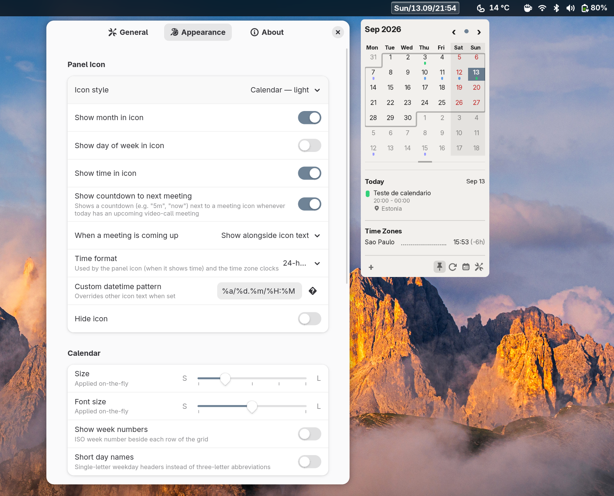

<h1>Litsycal &nbsp;</h1>

A compact calendar indicator for the GNOME panel, inspired by [Itsycal](https://github.com/sfsam/itsycal) for macOS.



## About

Litsycal brings the simplicity of Itsycal to Linux. Click the panel indicator to reveal a small monthly calendar. No frills, no clutter.

**Supported GNOME Shell versions:** 48, 49, 50

## Keyboard Shortcuts

While the calendar popup is open, these keys work — arrow keys and vi-style
`h`/`j`/`k`/`l` both move the selected day around (use `j` in place of `Down`
if the arrow key doesn't respond, since GNOME Shell reserves it for its own
menu navigation). The rest mirror [Itsycal's own shortcuts](https://www.mowglii.com/itsycal/help),
with Ctrl standing in for Itsycal's Command key (there's no Command key on
Linux):

| Key | Action |
| --- | --- |
| `←` / `h` | Previous day |
| `→` / `l` | Next day |
| `↑` / `k` | Previous week |
| `j` | Next week |
| `Shift + ←` / `Shift + H` | Previous month |
| `Shift + →` / `Shift + L` | Next month |
| `Shift + ↑` / `Shift + K` | Next year |
| `Shift + ↓` / `Shift + J` | Previous year |
| `Space` | Jump to today |
| `#` | Show selected day's offset from today and day of year |
| `Ctrl + J` / `Ctrl + K` | Add/remove a week row in the calendar |
| `P` | Pin/unpin the calendar |
| `W` | Show/hide calendar week numbers |
| `.` | Show/hide event locations in the agenda |
| `Ctrl + ,` | Open Settings |
| `Ctrl + O` | Open the default calendar app |
| `Ctrl + Shift + J` | Open the first active virtual meeting in the agenda |
| `Ctrl + N` | Create a new event |
| `Ctrl + Shift + T` | Go to date |
| `Ctrl + Alt + R` | Refresh events |
| `Ctrl + Q` | Quit Litsycal |

### Event info popover

Clicking an event in the agenda opens a small read-only popover with its details, right next to the row — itsycal's own popover, ported. These keys work while it's open:

| Key | Action |
| --- | --- |
| `Esc` | Close the popover |
| `Backspace` / `Delete` | Delete the event (repeating events ask you to confirm first, same as the edit dialog's own Delete button) |

Clicking anywhere outside the popover closes it; clicking a different event closes this one and opens that event's popover in the same click. Editing an event is one step further away now — right-click the event and choose **Edit…**.

## Installation

1. Clone the repository:
   ```bash
   git clone git@github.com:mlkonrad/litsycal.git
   ```

2. Copy to your GNOME extensions directory:
   ```bash
   cp -r litsycal ~/.local/share/gnome-shell/extensions/litsycal@mlkonrad.github.com
   ```

3. Compile the settings schema:
   ```bash
   glib-compile-schemas ~/.local/share/gnome-shell/extensions/litsycal@mlkonrad.github.com/schemas/
   ```

4. Restart GNOME Shell and enable the extension:
   ```bash
   gnome-extensions enable litsycal@mlkonrad.github.com
   ```

## Credits

Litsycal is a Linux port of **[Itsycal](https://github.com/sfsam/itsycal)**, a tiny menu bar calendar for macOS created by **[sfsam](https://github.com/sfsam)**. The original concept, design, and inspiration all belong to him.

- Original project: https://github.com/sfsam/itsycal
- Original author's website: http://www.mowglii.com/itsycal

The name "Litsycal" and its framing as a port of Itsycal were approved by
Sanjay Madan directly via email.

## License

MIT License — see [LICENSE](LICENSE) for details.

The original Itsycal is also released under the MIT License.
